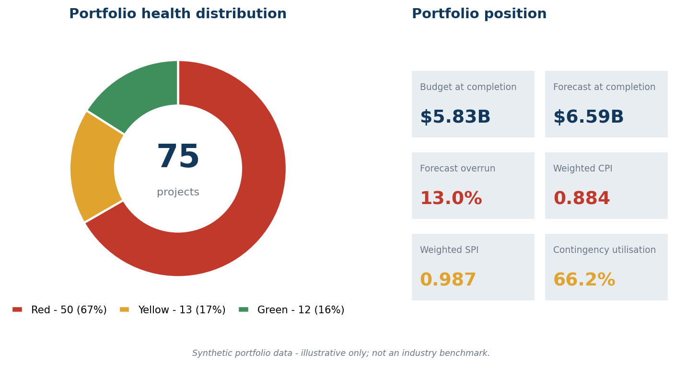
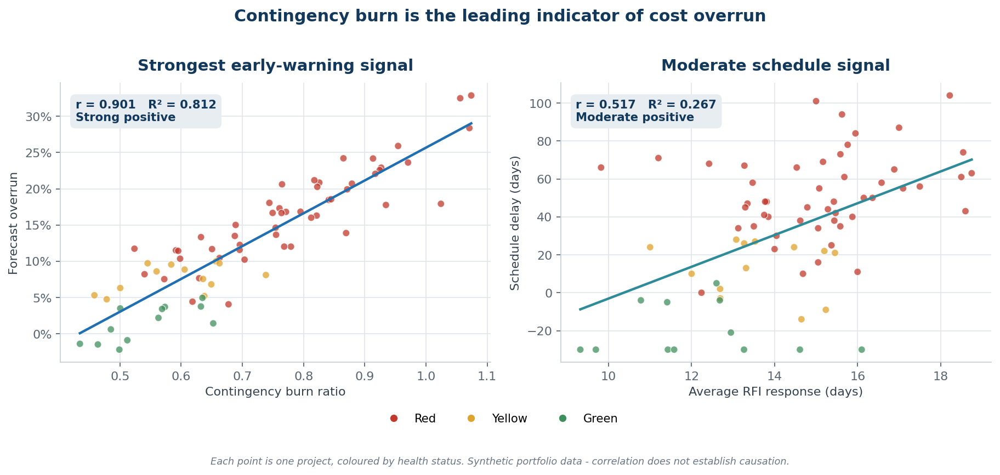
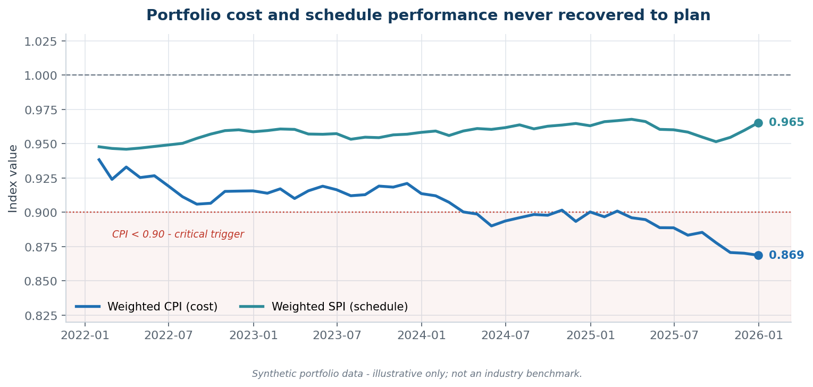
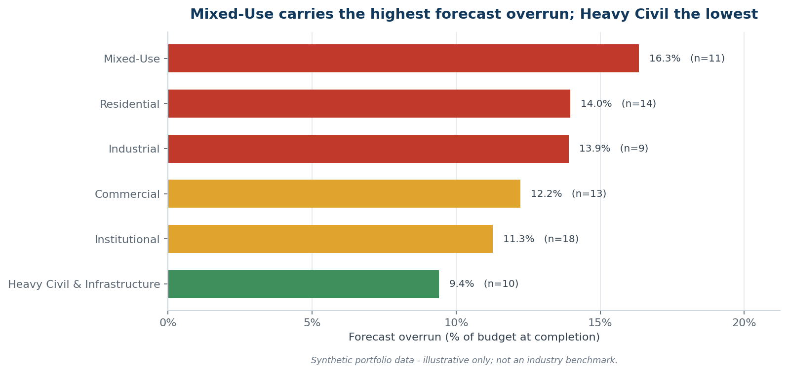
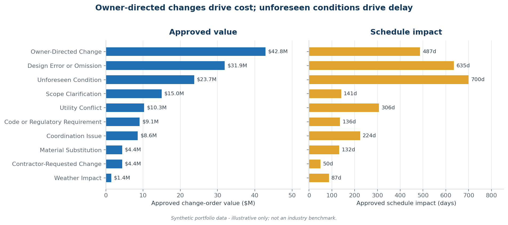
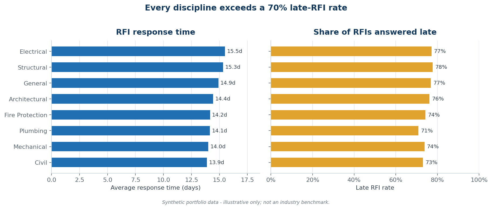
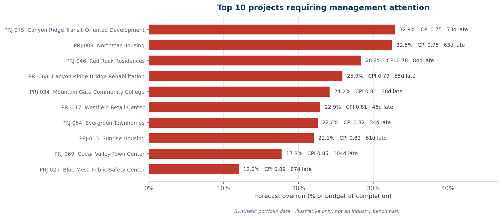

# Construction Project Controls Analytics

**Early-warning analysis of cost and schedule performance across a 75-project, $5.83B construction portfolio.**

An end-to-end data analytics case study covering the full Ask → Prepare → Process → Analyze → Share → Act cycle: data generation, SQL cleaning and quality control, exploratory and statistical analysis, executive reporting, and an operational action plan with automation.

> **Data disclosure — please read.** Every record in this repository is **synthetic**. The portfolio, projects, clients, and personnel are fictional. Nothing here represents actual client performance, confidential operational data, or verified construction-industry benchmarks. See [`documentation/dataset_methodology.md`](documentation/dataset_methodology.md).

---

## The question

Construction cost overruns are usually detected at the point they have already become unavoidable. This analysis asks a narrower, more useful question:

> **Which project-controls metrics move *first* — early enough to intervene?**

To answer it, the study reconstructs a 48-month portfolio (2022–2025) of earned-value data, change orders, and RFI logs, then tests candidate leading indicators against realised cost and schedule outcomes.

---

## Headline findings



The portfolio is forecast to finish **$755.6M (13.0%) over budget**, at a weighted CPI of **0.884**. Two-thirds of projects (50 of 75) sit at Red status.

### 1. Contingency burn ratio is the strongest early-warning signal



Contingency burn ratio explains **81% of the variance** in forecast overrun (r = 0.901). It is measurable from month one and moves well before CPI crosses a reporting threshold — making it the most actionable metric in this dataset.

RFI response time shows a weaker but real association with schedule delay (r = 0.517, R² = 0.267). Notably, **RFI *density* does not predict delay** (r = −0.058): how fast RFIs are answered matters, how many are raised does not.

### 2. Cost performance degraded steadily and never recovered



Weighted CPI fell from 0.938 to 0.869 across 48 months. It first breached the 0.90 critical threshold in April 2024, oscillated around it into early 2025, and has stayed below it since February 2025. Weighted SPI held near 0.97–0.99 throughout — schedule *index* performance looks healthy while **average forecast delay is still 33.7 days**. SPI converges toward 1.0 as projects complete regardless of how late they finish, so delay in days is the more honest schedule measure.

### 3. Exposure concentrates by project type and delivery method



Mixed-Use carries a 16.3% forecast overrun against Heavy Civil's 9.4%. By delivery method, CMAR performs best (9.6% overrun, 0.910 CPI) and Integrated Project Delivery worst (14.6%) — though with only 5 IPD projects, that gap is not something to generalise from.

### 4. Change orders: cost and schedule impact come from different causes



Owner-directed changes drive the most **cost** ($42.8M approved). Unforeseen conditions drive the most **delay** (700 days). A cost-only change-order review would miss the largest schedule driver entirely.

### 5. RFI turnaround is a portfolio-wide process failure



Every discipline answers more than **70% of RFIs late**, with average response times clustered tightly between 13.9 and 15.5 days. The uniformity is the finding: this is a systemic process constraint, not a few underperforming disciplines.

### 6. Ten projects concentrate the risk



---

## Repository structure

```
construction-project-controls-analytics/
├── data/
│   ├── raw/                  4 source CSVs (projects, monthly performance, change orders, RFIs)
│   ├── cleaned/              Validated, type-cast, deduplicated outputs
│   └── processed/            SQLite database, data-quality summary, rejected records
├── sql/                      Schema, quality checks, analysis views, analytical queries
├── analysis/
│   ├── tables/               11 analytical outputs (CSV)
│   ├── excel/                Formula-driven analysis workbook
│   └── visualization/        generate_charts.py — reproduces every figure in this README
├── share/
│   ├── assets/               Publication charts (PNG)
│   └── portfolio/            Portfolio case-study webpages
├── act/                      90-day action register and governance workbook
├── final_report/             Consolidated case-study report (DOCX + PDF)
├── automation/               Python alerting script + PowerShell pipeline runner
└── documentation/            Phase documentation, data dictionary, methodology, cleaning log
```

New to the repo? [`START_HERE.md`](START_HERE.md) gives a recommended reading order.

## Data model

| Table | Rows | Grain |
|---|---:|---|
| `projects` | 75 | One row per project |
| `monthly_performance` | 1,743 | Project × reporting month |
| `change_orders` | 553 | One row per change order |
| `rfi_log` | 1,514 | One row per RFI |

Four analytical views (`vw_project_performance_analysis`, `vw_change_order_summary`, `vw_rfi_summary`, `vw_latest_monthly_performance`) sit on top of these tables, defined in [`sql/03_create_analysis_views.sql`](sql/03_create_analysis_views.sql).

---

## Reproducing the analysis

```bash
git clone https://github.com/<your-username>/construction-project-controls-analytics.git
cd construction-project-controls-analytics

python -m venv .venv
source .venv/bin/activate        # Windows: .venv\Scripts\activate
pip install -r requirements.txt

# Regenerate every chart in share/assets/ from analysis/tables/
python analysis/visualization/generate_charts.py
```

Query the database directly:

```bash
sqlite3 data/processed/construction_project_controls_clean.db < sql/04_analysis_queries.sql
```

---

## Method and metrics

Earned-value metrics follow standard PMI definitions:

| Metric | Formula |
|---|---|
| CPI | EV ÷ AC |
| SPI | EV ÷ PV |
| EAC | AC + (BAC − EV) ÷ CPI |
| Forecast overrun % | (EAC − BAC) ÷ BAC |
| Contingency burn ratio | Contingency used ÷ (Original contingency × % complete) |

Health status is assigned by threshold triggers: CPI < 0.90, forecast overrun > 10%, delay > 30 days, contingency utilisation > 90%. Of the 50 Red projects, **42 are driven primarily by CPI < 0.90**.

Phase-by-phase methodology is documented in [`documentation/`](documentation/): [process](documentation/process_phase_documentation.md), [analyze](documentation/analyze_phase_documentation.md), [share](documentation/share_phase_documentation.md), and [act](documentation/act_phase_documentation.md).

## Limitations

- **Synthetic data.** Correlations reflect the generating process, not observed industry behaviour, and cannot establish construction benchmarks.
- **Correlation is not causation.** No causal identification strategy is used anywhere in this analysis.
- **Small subgroups.** Integrated Project Delivery (n=5) and Cost Plus contracts (n=10) are too small to support generalisation.
- **Known data-quality gap.** Four projects carry an `Unknown` contract type. These were retained deliberately rather than dropped, and are reported as-is in [`data/processed/data_quality_summary.csv`](data/processed/data_quality_summary.csv).
- **Approved CO % vs cost growth (r = 0.9998)** is near-tautological — approved change orders are a component of cost growth by construction. It is reported for completeness, not as a finding.

---

## License

Code and documentation released under the [MIT License](LICENSE). Synthetic datasets may be reused for educational purposes with attribution.
